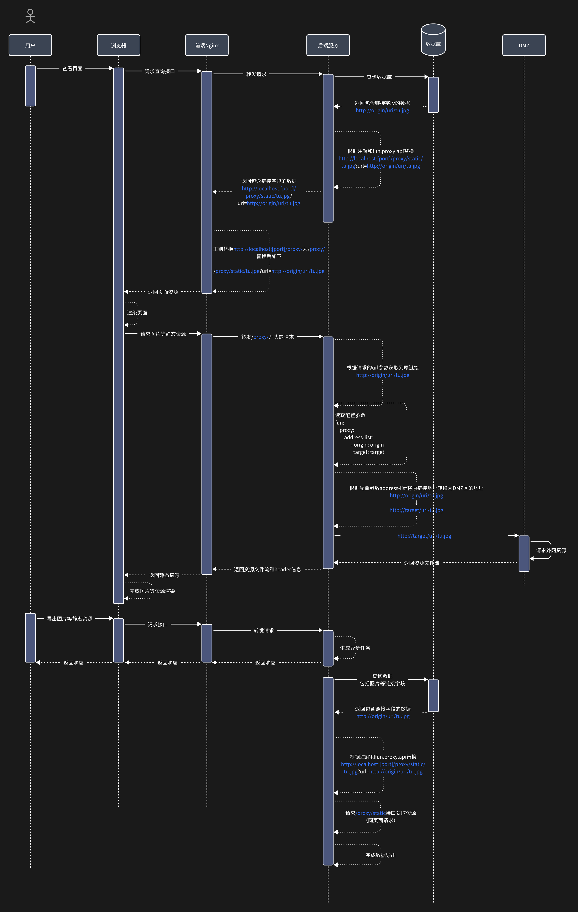

# 简介

静态资源代理组件

# 快速开始

## 1. 添加依赖

```xml

<dependencies>
  <dependency>
    <groupId>com.github.fanzezhen</groupId>
    <artifactId>fun-framework-proxy-fastjson</artifactId>
    <version>${revision}</version>
  </dependency>
  <dependency>
    <groupId>com.github.fanzezhen</groupId>
    <artifactId>fun-framework-proxy-mybatis</artifactId>
    <version>${revision}</version>
  </dependency>
  <dependency>
    <groupId>com.github.fanzezhen</groupId>
    <artifactId>fun-framework-proxy-orika</artifactId>
    <version>${revision}</version>
  </dependency>
</dependencies>
```

## 2. 添加yml配置文件

### 2.1 基础配置

```yaml
fun:
  proxy:
    # 开关，不设置默认为false
    enabled: true
    # 代理接口的地址，必须设置，若无特殊则只需要替换端口号即可
    api: http://localhost:${server.port}/proxy/static/
    # 外网地址映射列表，必须设置，用来将原始地址替换为dmz区代理地址
    # origin为原始地址，必须设置
    # target为dmz区代理地址，必须设置
    address-list:
      - origin: origin1.com
        target: target1
      - origin: origin2.com
        target: target2
```

## 3. 适用场景

* 【后端】使用@ProxyField注解实现，在需要代理的字段上标注@ProxyField
* 【前端】Nginx需要将 http://localhost:9999/proxy/static/ 替换成 /proxy/static/
* 静态资源代理时序图 

### 3.1 mybatis

在mybatis实体类上添加注解

```java

@Data
@Accessors(chain = true)
@NoArgsConstructor
@TableName(value = "tmp_test", autoResultMap = true)
public class TestDO extends BaseEntity {

    /**
     * 链接
     */
    @ProxyField
    private String url;
}
```

### 3.2 fastjson

#### 3.2.1 在需要使用fastjson序列化的字段上添加注解

```java

@Data
@Accessors(chain = true)
@NoArgsConstructor
public class TestBO extends BaseBO {

    /**
     * 链接
     */
    @ProxyField
    private String url;
}
```

#### 3.2.2 使用ProxyFastJsonSerializeValueFilter序列化

```java
class ProxyTest {
    @Resource
    ProxyFastJsonSerializeValueFilter proxyFastJsonSerializeValueFilter;

    void testFastjson() {
        TestBO bo = new TestBO().setUrl("https://origin1.com/tu.jpg");
        String jsonString = JSON.toJSONString(po, proxyFastJsonSerializeValueFilter);
    }
}
```

### 3.3 orika

#### 3.3.1 添加yml配置文件

```yaml
fun:
  proxy:
    # 开关，不设置默认为false
    enabled: true
    orika:
      # 开关，不设置默认为false
      enabled: true
```

#### 3.3.2 在需要使用orika复制的字段上标注注解：@ProxyField

```java

@Data
@Accessors(chain = true)
@NoArgsConstructor
public class TestBO extends BaseBO {

    /**
     * 链接
     */
    @ProxyField
    private String url;
}
```
